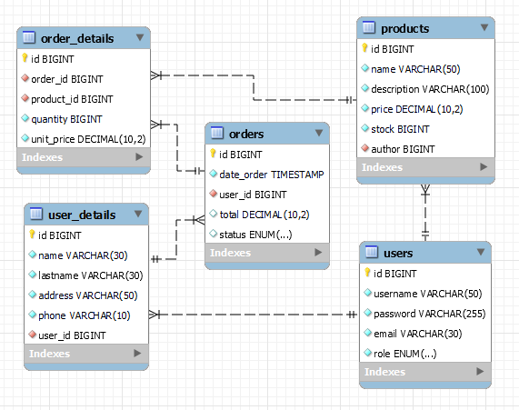
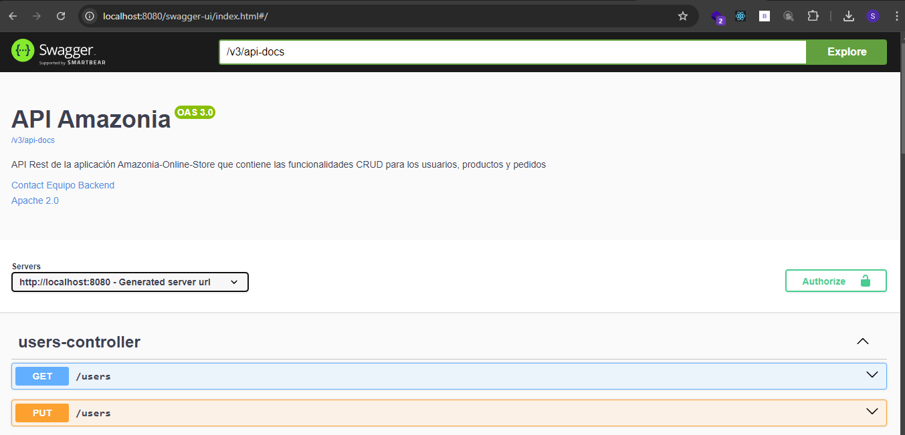
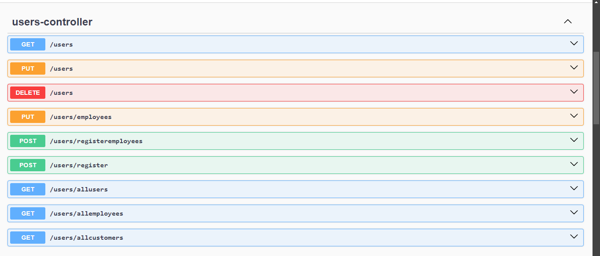
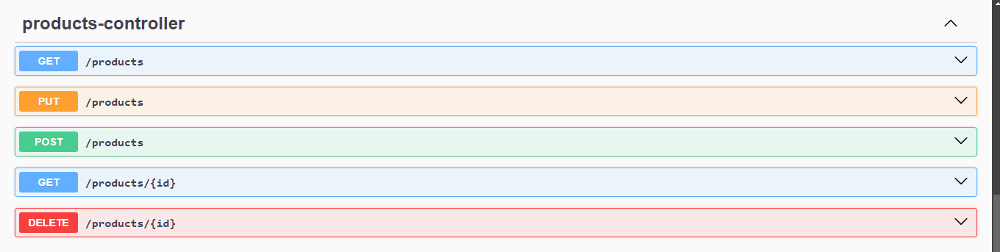
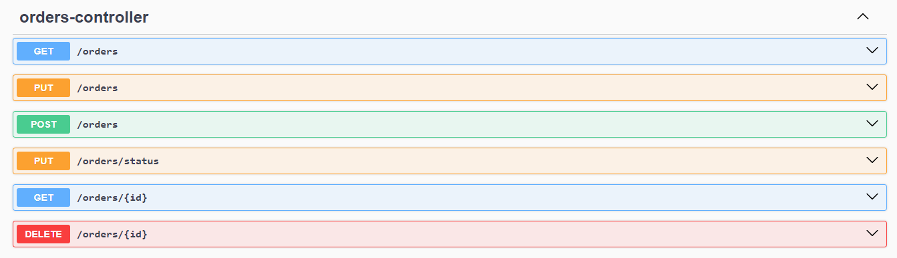
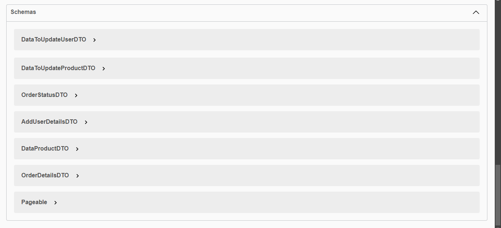

<h1 align="center"> Amazonia Tineda Online</h1>

## Descripcion

- Aplicacion creada para replicar el funcionamiento de una tienda online del lado del backend.

### Tecnologias utilizadas

---

---

- Java Version 17
- Spring Boot 3 Version 3.2.2
- Spring Security
- Seguridad JJWT Version 0.12.3 (JSON Web Tokens)
- Mysql 8.0.34
- OpenApi 2.6.0
- JPQL (Java Persistence Query Language)

## Diagrama de la base de datos

- Dentro de la carpeta /ReadmeAssets se encuentra el diagrama creado con Workbench

### Como utilizarlo?

- Instala las tecnologias mencinadas arriba en tu equipo
- Crea una base de datos llamada <b>Amazonia</b>
- Descarga el proyecto
- Configura el usuario para accesar a la base de datos utilizando en el archivo application.properties
- Ejecuta la aplicacion

## Funciones del proyecto

- Permite que los clientes se registren para realizar sus pedidos. También será posible modificar dicha informacion una vez creado el registro.
- Podran guardar pedidos con los productos que indiquen. Este mismo registro podra ser devuelto o marcado como cancelado dependiendo del estado en el que se encuentre.
- Los empleados podran modificar los pedidos para indicar cuando se han enviado o entregado
- Un empleado tambien podra guardar nuevos productos, eliminarlos, modificarlos o consultarlos.

## Endpoints

- [POST]/users
    - /register -> Permite a los clientes registrarse utilizando una peticion post con los siguientes parametros: 
    
                username, 
                password,
                mail,
                name
                lastname,
                address,
                phone
    - [POST] /registeremployees -> Permite que un usuario con rol SYS registre un nuevo empleado utilizando los mismos campos que el endpoint anterior

  
- [POST]/login
    - Autenticacion del usuario utilizando los siguientes parametros:
            
            username
            password

- [GET]/products
    - Permite consultar todos los productos del sistema

- [GET]/products/id
    - Permite consultar los datos de un producto en particular

- [POST]/products
    - Permite guardar un producto nuevo utilizando los siguientes parametros:

            name
            description
            price
            stock

Estos son los endpoints principales, fueron creados mas. Para obtener informacion, por favor referirse a la documentacion dentro de la aplicacion, y para realizar pruebas pueden hacer uso de swagger a traves de la url http://localhost:8080/swagger-ui.html

